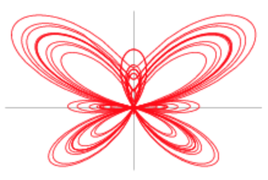
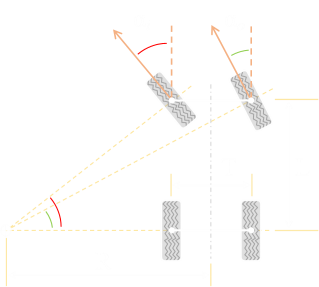

% 기초 컴퓨터 그래픽스 - 프로그래밍 숙제 3
% 2019년 5월 20일
% 서강대학교 국어국문학전공 20120085 엄태경

# OpenGL API 함수를 사용한 3D 뷰잉 연습

## 요구 기능 구현 내용

### (a) 물체의 배치 및 움직임 구현

#### i. 움직이는 호랑이 (구현 완료)

호랑이는 바닥 평면의 한쪽 구석에서 출발하여 바닥 가장자리를 따라 이동한다. 반대쪽 구석에 도착하면 반시계 방향으로 회전하여 계속 이동한다.

#### ii. 계층적 모델링 방식의 자동차 (구현 완료)

##### 자동차의 이동 (구현 완료)

자동차는 세상좌표계에서 다음 식에 따라 원점을 중심으로 나비 모양을 그리며 이동한다. `[1]`

$$
\left\{
\begin{aligned}
x &= \sin(t) \left(e^{\cos(t)} - 2\cos(4t) - \sin^5\left({t \over 12}\right)\right) \\
y &= \cos(t) \left(e^{\cos(t)} - 2\cos(4t) - \sin^5\left({t \over 12}\right)\right) \\
z &= 0 \\
\end{aligned}
\right .
$$

이는 `x-y` 평면상에서 다음과 같은 궤적을 그린다.

{width=40%}

##### 바퀴의 좌우 회전 (구현 완료)

차량의 회전에 따라 바퀴가 자연스럽게 움직이기 위해서는 다양한 모델을 이용할 수 있는데, 본 프로젝트에서는 아커만 조향 모델(Ackermann Steering Model)을 따른다. 간략한 도식은 아래와 같다. `[2]`

{width=40%}

이를 이용하기 위해서는 차량이 이동하는 궤적의 접원의 중심을 알아야 한다. 그런데 위의 복잡한 곡선 식으로부터 정확한 접원을 계산하려면 매우 복잡한 연산이 필요하다. 따라서 본 프로젝트에서는 `<자동차의 직전 위치, 자동차의 현재 위치, 자동차의 다음 위치>`의 세 점이 그리는 삼각형의 외접원을 접원의 근사값으로 이용한다.

##### 바퀴의 구름 (구현 완료)

바퀴가 굴러가는 것을 자연스럽게 표현하려면, 매 프레임마다 자동차가 이동한 거리만큼 바퀴가 회전해야 한다. 위 곡선의 호를 정확히 계산하는 것은 매우 복잡한 연산을 요구하므로, 본 프로젝트에서는 `자동차의 현재 위치`와 `자동차의 직전 위치` 사이의 거리를 근사값으로 이용한다. 이 거리와 바퀴의 반지름을 이용해 바퀴가 굴러야 하는 각도를 계산하여 매 프레임마다 그만큼 바퀴를 회전시킨다.

#### iii. 추가 3D 모델 배치

1. 자동차가 이동하는 복잡한 궤적을 표시하기 위하여, 경로를 따라 바닥 평면에 작게 축소한 버스를 총 240개 배치했다. 적절한 회전변환을 통해 경로가 매끄럽게 표현되도록 한다.
2. 주전자 네 개를 바닥 평면의 꼭지점에 배치했다. 각 주전자는 주둥이가 원점을 향하도록 적절히 회전해있다.
3. 자동차가 지나다니는 경로 중간에 사람이 쓰러진 형태로 아이언맨을 배치했다.
4. 자동차 위에 거미
5. TODO: 랜덤한 위치의 용

#### iv. 키보드와 마우스를 이용한 조작

1. TODO: 주전자 회전
2. TODO: 거미 점프
3. TODO: 용 날아가서 없어지기 / 다시 랜덤한 위치에 날아오기

<!-- TODO: 세 개를 키보드와 마우스로 조작 -->

### (b) 카메라의 배치 및 움직임 구현 (구현 완료)

#### i. 주 카메라 (구현 완료)

##### A. 주 카메라 배치 (구현 완료)

- 조작: `r`

`(75, 75, 100)`에서 `z`축 방향을 위쪽으로 하여 원점을 바라보도록 설정하였다. 카메라가 다른 위치로 이동하거나 다른 뷰가 적용된 상태에서 `r` 키를 입력하면 최초의 위치로 카메라가 복구된다.

##### B. 주 카메라 줌 (구현 완료)

- 조작: `SHIFT`+마우스 왼쪽 버튼+마우스 좌우 이동

`SHIFT`를 누른 상태에서 마우스가 왼쪽/오른쪽으로 이동하면 주 카메라가 각각 줌 인/줌 아웃된다.

FreeGLUT 라이브러리의 한계로 SHIFT 키가 눌린 여부를 확인하려면 키보드 또는 마우스 입력이 필요하다. 따라서 마우스 왼쪽 버튼 이미 누른 상태에서 SHIFT를 누르거나 떼면 동작에 변화가 없다. 오직 `SHIFT`를 먼저 누르고 마우스 왼쪽 버튼을 누르고 좌우로 이동할 때에만 줌 효과가 발생한다.

##### C. 주 카메라 회전 (구현 완료)

- 조작: `↑`, `↓`, `←`, `→`

카메라는 항상 원점을 중심으로 하는 가상의 구면체 위에서 움직이면서 항상 원점을 바라본다. 위쪽 화살표를 누르면 카메라는 원점 방향으로 구면체를 따라 위로 올라간다. 카메라가 원점 바로 위에 있으면 위쪽 화살표를 눌러도 더 올라갈 곳이 없으므로 카메라는 움직이지 않는다. 아래쪽 화살표를 누르면 카메라는 원점 반대 방향으로 구면체를 따라 아래로 내려간다. 좌우 화살표를 누르면 해당하는 방향으로 지면에 수평하게 카메라가 구면 둘레로 회전한다.

#### ii. 부 카메라 (구현 완료)

##### A. 부 윈도우 토글 (구현 완료)

- 조작: `1`

`1` 키를 입력하면 부 윈도우가 토글된다. 부 윈도우는 주 윈도우의 왼쪽 아래 위치에 가로세로 크기가 주 윈도우의 1/4 크기로 설정된다. 카메라는 `(0, 75, 0)`에서 원점을 바라보는 상태로 초기화된다. 부 카메라 좌표계의 `v`축은 항상 세상좌표계의 `z`축과 일치한다.

##### B. 부 윈도우 이동 (구현 완료)

- 조작: `CTRL`+`↑`, `CTRL`+`↓`, `CTRL`+`←`, `CTRL`+`→`, `CTRL`+`z`, `CTRL`+`x`, `CTRL`+`r`

부 윈도우가 토글된 상태에서 `CTRL` 키를 누른 채로 상하좌우 화살표 키를 누르면 부 카메라가 해당 방향으로 이동한다. `z`, `x` 키를 누르면 부 카메라가 앞뒤로 이동한다. `r` 키를 누르면 부 카메라의 위치가 초기 상태인 `(0, 75, 0)`으로 돌아간다.

##### C. 부 윈도우 회전 (구현 완료)

- 조작: `CTRL`+`c`, `CTRL`+`v`

부 윈도우가 토글된 상태에서 `CTRL` 키를 누른 상태로 `c`, `v` 키를 누르면 부 카메라 좌표계가 `v`축을 기준으로 각각 반시계/시계 방향으로 회전한다.

##### D. 부 윈도우 줌 (구현 완료)

- 조작: `CTRL`+`a`, `CTRL`+`s`

부 윈도우가 토글된 상태에서 `CTRL` 키를 누른 상태로 `a`, `s` 키를 누르면 부 카메라가 각각 줌 인/줌 아웃 된다.

### iii. 운전석 카메라 (구현 완료)

- 조작: `2`

`2` 키를 입력하면 운전석 윈도우가 토글된다. 운전석 윈도우는 주 윈도우의 왼쪽 위 위치에 가로세로 크기가 주 윈도우의 1/4 크기로 설정된다.

### iv. 호랑이 눈 카메라 (구현 완료)

- 조작: `3`

`3` 키를 입력하면 눈 윈도우가 토글된다. 눈 윈도우는 주 윈도우의 오른쪽 위 위치에 가로세로 크기가 주 윈도우의 1/4 크기로 설정된다.

---
<!--markdownlint-disable MD034 -->
[1] 나비모양 곡선에 관한 정보는 다음 링크에서 참조하였다. http://mathworld.wolfram.com/ButterflyCurve.html

[2] 아커만 조향 모델에 관한 정보는 다음 링크에서 참조하였다. http://datagenetics.com/blog/december12016/index.html